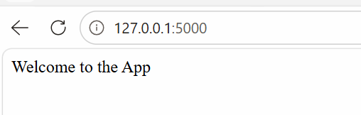
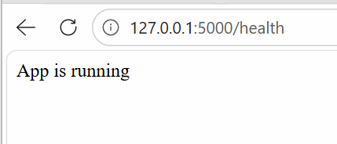
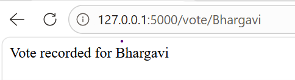
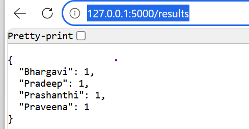
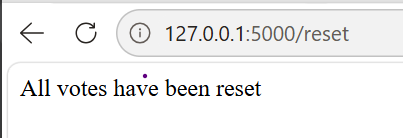

Flask Voting Application
Project Description
This project is a simple Flask web application that provides a basic voting system.
Users can vote for candidates by using a URL, view the current vote counts, and reset all stored votes.
The application stores voting information temporarily in memory while the application is running.

Installation and Setup (Windows)
Step 1: Clone the repository

Code
git clone https://github.com/sirigiribhargavi-web/flask-voting-app.git
cd flask-voting-app
Step 2: Create a virtual environment

Code
python -m venv venv
Step 3: Activate the virtual environment

PowerShell:

Code
venv\Scripts\Activate.ps1
Command Prompt:

Code
venv\Scripts\activate.bat
Step 4: Install dependencies

Code
pip install -r requirements.txt
Step 5: Run the application

Code
python app.py
The application will be available at:

Code
http://localhost:5000
API Endpoint Reference
Endpoint	Method	Description	Example Response
/	GET	Displays the welcome message	Welcome to the App
/health	GET	Checks whether the application is running	App is running
/vote/<name>	GET	Records one vote for the specified candidate	Vote recorded for Rahul
/results	GET	Returns the current vote count for all candidates as JSON	{"Rahul": 2, "Priya": 1}
/reset	GET	Clears all stored vote counts	All votes have been reset

Git Workflow
This project uses two Git branches:

dev — Used for all development work.

main — Contains stable and working versions of the application.

Workflow:

Code
        Development
             ↓
           dev
             ↓
      Test the feature
             ↓
      Feature complete?
             ↓
      Merge dev → main
             ↓
       Stable release
Version 1 was developed and tested in dev before being merged into main.

Version 2 was developed on top of Version 1 in dev, tested, and then merged into main.

No application development was performed directly on main.

Version History
Version	Features
Version 1	Flask application with / and /health endpoints
Version 2	Added /vote/<name>, /results, and /reset

Screenshots
1. Application Running

Welcome and /health

2. Voting App

Added voting users, /results, /reset

3. Git History

Screenshots of commit and merge history

(Screenshots are stored in the Screenshots/ folder)

